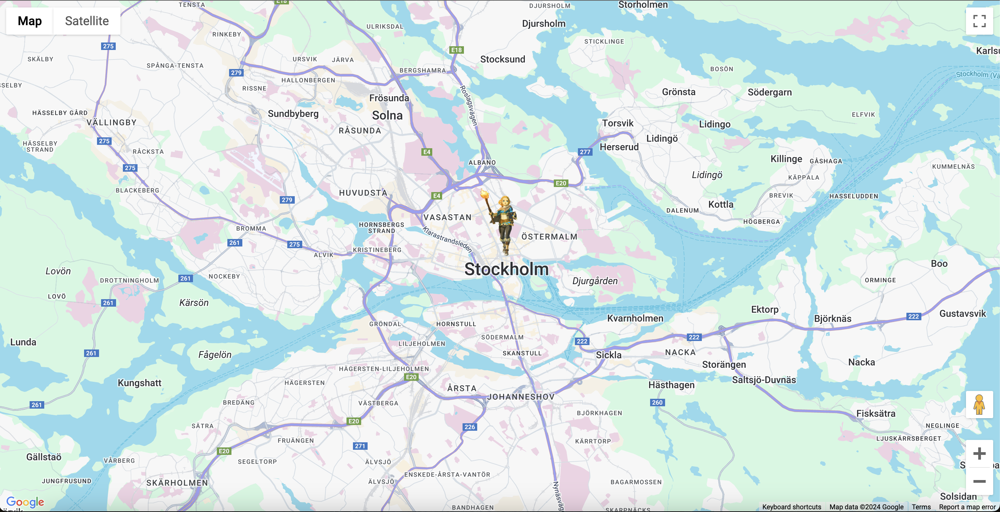

# DevProjects - Build a custom google maps theme

This is an open source project from [DevProjects](http://www.codementor.io/projects) and demonstrates a custom Google Map with custom marker.
Find the project requirements here: [Build a custom google maps theme](https://www.codementor.io/projects/web/build-a-custom-google-maps-theme-bf8levr6eg)

## Tech/framework used

Built with JavaScript, HTML, CSS.

## Screenshots and demo

## License

[MIT](https://choosealicense.com/licenses/mit/)
Most open source projects use the MIT license. Feel free to choose whichever license you prefer.
